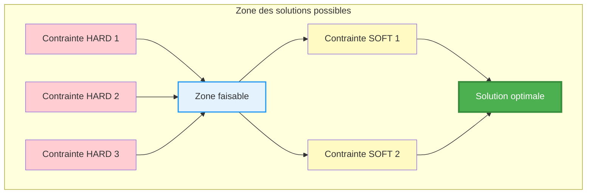

# Visualisation de la recherche de solution CP-SAT

---

## 🖼️ Illustration du processus de résolution

### Analogie avec les problèmes linéaires

- Chaque contrainte HARD définit une "droite" ou une "zone" dans l'espace des solutions.
- L'intersection de toutes les contraintes HARD forme la **zone faisable** (polytope).
- Les contraintes SOFT définissent des "directions préférées" à l'intérieur de la zone faisable.
- Le solveur explore l'espace, teste les combinaisons, et cherche le **point optimal** qui minimise la fonction objectif.

---

## Diagramme explicatif (Mermaid)



---

## 🧠 Explication

- **Zone faisable** : Toutes les solutions qui respectent les contraintes HARD
- **Contraintes SOFT** : Orientent la recherche vers les solutions préférées
- **Solution optimale** : Le solveur CP-SAT explore la zone faisable et choisit la solution qui minimise la fonction objectif (somme des pénalités soft)

---

## 🔗 Pour aller plus loin
- [Visualisation CP-SAT Google](https://developers.google.com/optimization/cp/cp_solver)

---

# Visualisation intuitive de la recherche CP-SAT

---

## 🖼️ Diagramme géométrique de la zone faisable et de la solution optimale

```mermaid
%% Diagramme géométrique de la zone faisable et de la solution optimale
graph TD
    subgraph Plan[Plan des solutions]
        H1[Contrainte HARD 1<br/>(droite 1)]
        H2[Contrainte HARD 2<br/>(droite 2)]
        H3[Contrainte HARD 3<br/>(droite 3)]
        ZF[Zone faisable<br/>(intersection des droites)]
        SOFT[Direction des contraintes SOFT<br/>(flèche d'optimisation)]
        OPT[Solution optimale<br/>(point le plus bas)]
    end

    H1 --> ZF
    H2 --> ZF
    H3 --> ZF
    ZF --> SOFT
    SOFT --> OPT

    style ZF fill:#e3f2fd,stroke:#2196f3,stroke-width:2px
    style OPT fill:#4caf50,color:#fff,stroke:#388e3c,stroke-width:3px
    style SOFT fill:#fff9c4,stroke:#fbc02d,stroke-width:2px
    style H1 fill:#ffcdd2
    style H2 fill:#ffcdd2
    style H3 fill:#ffcdd2
```

---

### 🧭 Explication étape par étape

1. **Définition des contraintes HARD**  
   → Chaque contrainte (ex : quota, couverture) définit une droite ou une frontière dans l'espace des solutions.

2. **Zone faisable**  
   → L'intersection de toutes les contraintes HARD forme un polygone (zone bleue) : toutes les solutions valides.

3. **Ajout des contraintes SOFT**  
   → Les contraintes SOFT (dispersion, équité, préférences) définissent une direction d'optimisation (flèche jaune).

4. **Recherche de la solution optimale**  
   → Le solveur CP-SAT explore la zone faisable et cherche le point qui minimise la fonction objectif (point vert).

---

### 🗺️ Figure schématique (ASCII)

```
      ^
     |         / (SOFT: direction d'optimisation)
     |        /
     |       /         (HARD 2: droite)
     |      /__________
     |     /         /
     |    /         /
     |   /         /
     |  /         /
     | /         /
     |/_________/________________>
    (HARD 1)   (HARD 3)

    [Zone faisable] = intersection des contraintes HARD
    [Solution optimale] = point le plus bas selon la direction SOFT
```

---

### 📚 Pour aller plus loin

- [OR-Tools CP-SAT Visualisation](https://developers.google.com/optimization/cp/cp_solver)
- [Constraint Programming - Wikipedia](https://en.wikipedia.org/wiki/Constraint_programming)

---
