# Documentation Algorithme CAP-SAT
## Système d'Optimisation de la Surveillance d'Examens

---

## 📋 Table des Matières

1. [Vue d'ensemble](#vue-densemble)
2. [Principe de fonctionnement](#principe-de-fonctionnement)
3. [Contraintes dures (HARD)](#contraintes-dures-hard)
4. [Contraintes souples (SOFT)](#contraintes-souples-soft)
5. [Fonction objectif](#fonction-objectif)
6. [Système de quotas ajustés](#système-de-quotas-ajustés)
7. [Ordre d'application des contraintes](#ordre-dapplication-des-contraintes)
8. [Paramètres du solveur](#paramètres-du-solveur)

---

## 🎯 Vue d'ensemble

L'algorithme **CAP-SAT** (Constraint Programming - Satisfiability) utilise le solveur **OR-Tools CP-SAT** de Google pour résoudre le problème d'affectation optimale des enseignants aux créneaux de surveillance d'examens.

### Objectif principal
Maximiser l'équité entre enseignants tout en respectant les contraintes organisationnelles et en tenant compte des préférences individuelles.

### Caractéristiques clés
- ✅ Équité stricte entre enseignants du même grade
- ✅ Respect des quotas de surveillance (ajustés inter-sessions)
- ✅ Prise en compte des vœux de non-disponibilité
- ✅ Dispersion intelligente des surveillances
- ✅ Gestion des enseignants responsables d'examens
- ✅ Optimisation multi-objectif pondérée

---

## ⚙️ Principe de fonctionnement

### Architecture complète du système CP-SAT avec quotas ajustés

```mermaid
graph TB
    subgraph DB[(Base de données SQLite)]
        DB1[Table: enseignant<br/>code, nom, grade, quota_base]
        DB2[Table: creneau<br/>date, heure, nb_surv]
        DB3[Table: voeu<br/>code_ens, jour, seance]
        DB4[Table: quota_enseignant<br/>Session N-1]
    end
    
    subgraph QuotaModule[📊 quota_enseignant_module.py]
        QM1[compute_quota_enseignant<br/>Session N-1]
        QM2{Quotas ajustés<br/>disponibles?}
        QM3[quota_ajuste_maj<br/>quota cumulé]
        QM4[Calcul différences<br/>vs quota théorique]
    end
    
    subgraph LoadData[📥 load_data_from_db]
        L1[Charger enseignants<br/>+ grades + quotas_base]
        L2[Charger créneaux<br/>+ salles]
        L3[Charger vœux]
        L4[load_adjusted_quotas<br/>Session N-1]
    end
    
    subgraph BuildModel[🏗️ Construction Modèle]
        B1[build_teachers_dict<br/>Pour chaque enseignant]
        B2{Quota ajusté<br/>existe?}
        B3[✅ quota = quota_ajuste_maj<br/>priorite_ajustee = -quota]
        B4[❌ quota = quota_base<br/>priorite_ajustee = 0]
        B5[Tri enseignants<br/>par priorite_ajustee]
        B6[Ceux qui ont MOINS surveillé<br/>= priorité HAUTE]
    end
    
    subgraph CPSATModel[🧮 Modèle CP-SAT]
        C1[Créer variables x i,j<br/>Exclusion vœux H2B, H2C]
        C2[Contrainte H1<br/>Couverture complète]
        C3[Contrainte H2A<br/>Équité par grade ±1]
        C4[Contrainte H3A<br/>x i,j ≤ quota ajusté]
        C5[Contrainte SOFT S3<br/>Priorité quotas ajustés]
        C6[coef = max1, 20-quota_ajuste_maj<br/>pénalité = nb_aff × coef × 15]
        C7[Objectif: Min Z<br/>Écarts + Dispersion + S3]
    end
    
    subgraph Solver[⚡ OR-Tools CP-SAT Solver]
        S1[Propagation contraintes]
        S2[Recherche solution optimale]
        S3[Minimiser pénalités]
    end
    
    subgraph SaveResults[💾 Sauvegarde]
        R1[Sauvegarder affectations<br/>Table affectation]
        R2[compute_quota_enseignant<br/>Session N]
        R3[Calculer nouveaux<br/>quota_ajuste Session N]
        R4[Mise à jour<br/>quota_enseignant N]
        R5[Prêt pour Session N+1]
    end
    
    %% Flux de données
    DB4 --> QM1
    QM1 --> QM2
    QM2 -->|Oui| QM3
    QM3 --> QM4
    
    DB1 --> L1
    DB2 --> L2
    DB3 --> L3
    QM4 --> L4
    
    L1 --> B1
    L4 --> B1
    
    B1 --> B2
    B2 -->|Oui| B3
    B2 -->|Non| B4
    B3 --> B5
    B4 --> B5
    B5 --> B6
    
    L2 --> C1
    L3 --> C1
    B6 --> C1
    
    C1 --> C2
    C2 --> C3
    C3 --> C4
    B3 --> C4
    C4 --> C5
    B3 --> C6
    C6 --> C5
    C5 --> C7
    
    C7 --> S1
    S1 --> S2
    S2 --> S3
    
    S3 --> R1
    R1 --> R2
    R2 --> R3
    R3 --> R4
    R4 --> R5
    
    %% Styles
    style DB fill:#e3f2fd
    style QuotaModule fill:#fff3e0
    style LoadData fill:#f3e5f5
    style BuildModel fill:#e8f5e9
    style CPSATModel fill:#fff9c4
    style Solver fill:#ffccbc
    style SaveResults fill:#c8e6c9
    
    style B3 fill:#4caf50,color:#fff
    style B4 fill:#ff9800,color:#fff
    style C4 fill:#f44336,color:#fff
    style C5 fill:#9c27b0,color:#fff
```

### Détail de l'utilisation des quotas ajustés dans le modèle

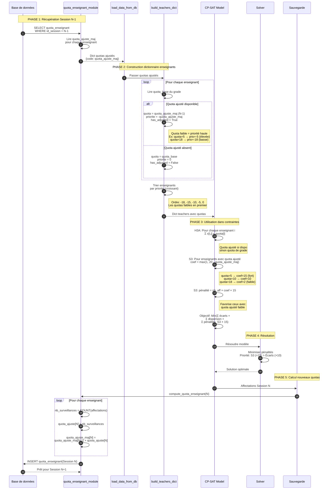

### Architecture globale

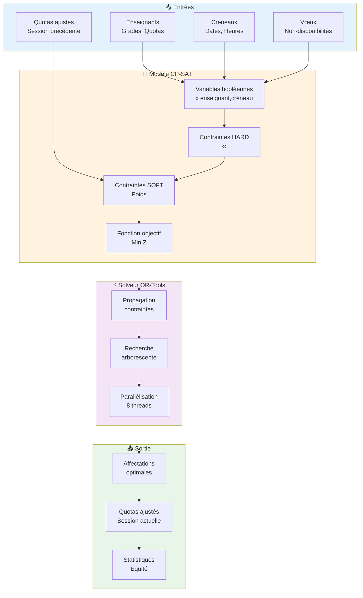

### 1. Variables de décision

Pour chaque combinaison **enseignant × créneau**, on crée une variable booléenne :

```
x[enseignant_i, creneau_j] ∈ {0, 1}
```

Où :
- `x[i,j] = 1` : l'enseignant `i` surveille le créneau `j`
- `x[i,j] = 0` : l'enseignant `i` ne surveille pas le créneau `j`

### 2. Réduction de l'espace de recherche

Certaines variables ne sont **pas créées** si :
- L'enseignant a émis un vœu de non-disponibilité pour ce créneau
- L'enseignant est responsable de toutes les salles de ce créneau

### 3. Résolution

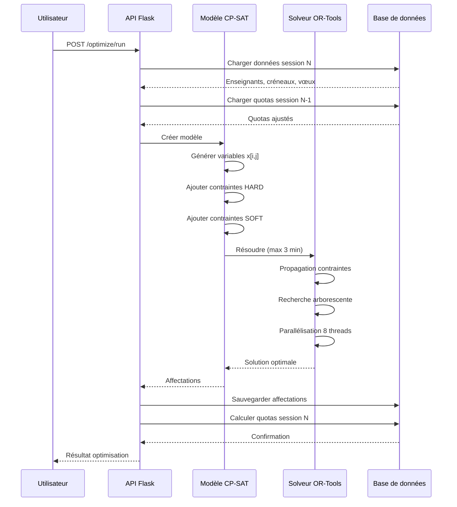

Le solveur CP-SAT explore intelligemment l'espace des solutions en :
1. Éliminant rapidement les branches infaisables
2. Propageant les contraintes
3. Utilisant des heuristiques de recherche
4. Optimisant la fonction objectif

---

## 🔒 Contraintes dures (HARD)

### Vue d'ensemble des contraintes HARD

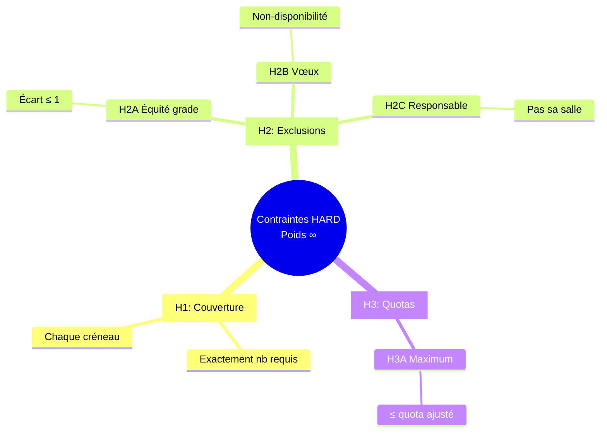

### Interactions entre contraintes

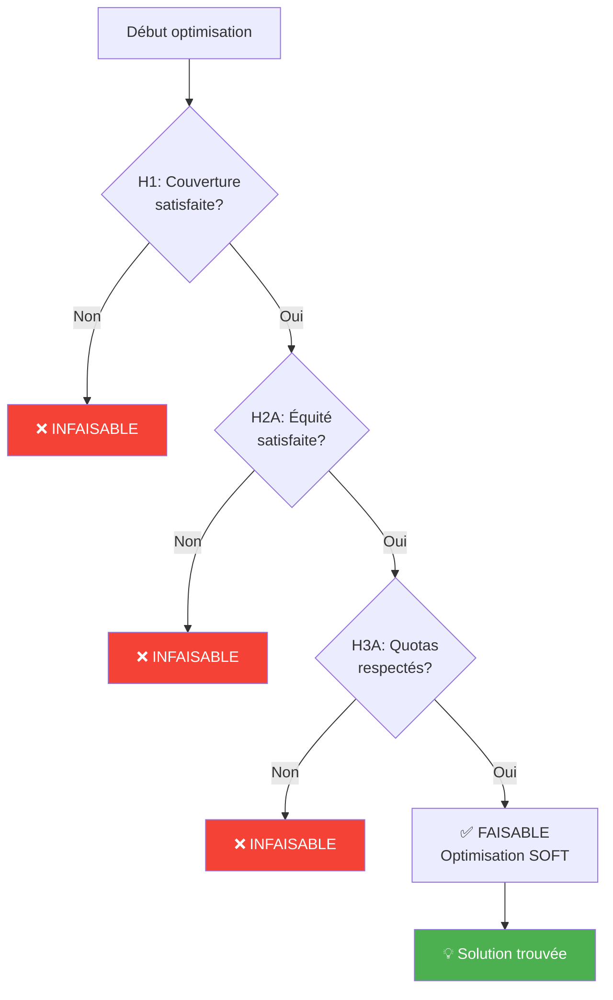

Les contraintes dures **DOIVENT** être respectées, sinon aucune solution n'est trouvée.

### H1 : Couverture complète des créneaux

**Description** : Chaque créneau doit avoir exactement le nombre de surveillants requis.

**Formulation mathématique** :
```
∀ créneau j : Σ x[i,j] = nb_surveillants_requis[j]
                i∈E
```

**Poids** : **∞** (contrainte absolue)

**Exemple** :
- Créneau 1 requiert 3 surveillants → exactement 3 enseignants affectés
- Créneau 2 requiert 5 surveillants → exactement 5 enseignants affectés

---

### H2A : Équité stricte par grade

**Description** : Au sein d'un même grade, l'écart entre le nombre de surveillances de deux enseignants ne peut pas dépasser 1.

**Formulation mathématique** :
```
∀ enseignants i, j du même grade :
    |nb_surveillances[i] - nb_surveillances[j]| ≤ 1
```

**Poids** : **∞** (contrainte absolue)

**Exemple** :
- Enseignant A (PR) : 7 surveillances
- Enseignant B (PR) : 8 surveillances ✅ (écart = 1)
- Enseignant C (PR) : 6 surveillances ✅ (écart ≤ 1 avec A et B)
- ❌ Un enseignant PR avec 10 surveillances serait refusé (écart > 1)

---

### H2B : Exclusion par vœux

**Description** : Un enseignant ne peut pas être affecté à un créneau pour lequel il a émis un vœu de non-disponibilité.

**Implémentation** :
```python
if (enseignant, jour, seance) in voeux_set:
    # Variable x[enseignant, creneau] non créée
    continue
```

**Poids** : **∞** (contrainte absolue)

---

### H2C : Exclusion responsable

**Description** : Un enseignant responsable d'un examen dans une salle ne peut pas surveiller cette salle au même moment, MAIS peut surveiller d'autres salles du même créneau.

**Règle** :
- ❌ Responsable de la salle A → Ne peut pas surveiller la salle A
- ✅ Responsable de la salle A → Peut surveiller la salle B (même créneau)
- ❌ Responsable de TOUTES les salles → Ne peut surveiller aucune salle

**Implémentation** :
```python
# Pour chaque créneau, identifier les salles où l'enseignant N'EST PAS responsable
salles_disponibles = [s for s in creneaux[j]['salles'] 
                       if responsable[s] != enseignant_i]

if not salles_disponibles:
    # Variable x[i,j] non créée
    continue
```

**Poids** : **∞** (contrainte absolue)

---

### H3A : Respect des quotas maximum

**Description** : Le nombre total de surveillances d'un enseignant ne peut pas dépasser son quota (ajusté si disponible).

**Formulation mathématique** :
```
∀ enseignant i : Σ x[i,j] ≤ quota_ajusté[i]
                  j∈C
```

**Poids** : **∞** (contrainte absolue)

**Note** : Le quota utilisé est le `quota_ajusté_maj` de la session précédente si disponible, sinon le quota de grade standard.

---

## 🎨 Contraintes souples (SOFT)

### Vue d'ensemble des contraintes SOFT

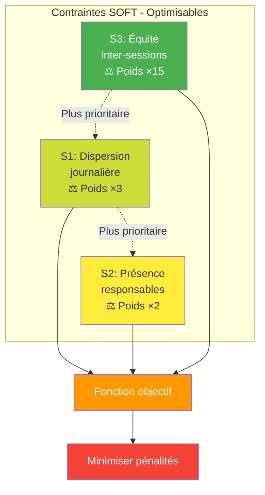

Les contraintes souples sont optimisées mais peuvent être violées si nécessaire.

### S1 : Dispersion dans la même journée

**Description** : Favoriser l'espacement des séances de surveillance pour un même enseignant dans une journée.

### Visualisation de la pénalité

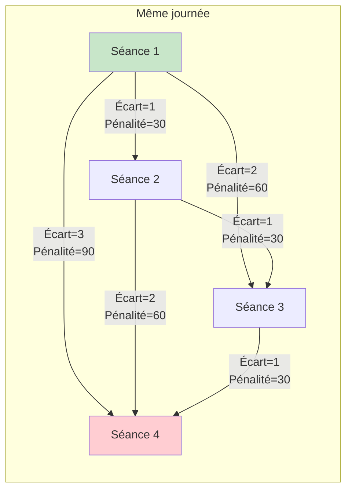

**Pénalité** :
```
pénalité = écart_séances × 10 × 3 (poids)
```

**Exemples** :
- Séances S1 et S2 (écart = 1) : pénalité = 1 × 10 × 3 = **30**
- Séances S1 et S3 (écart = 2) : pénalité = 2 × 10 × 3 = **60**
- Séances S1 et S4 (écart = 3) : pénalité = 3 × 10 × 3 = **90**

**Poids dans l'objectif** : **×3**

**Impact** : Évite qu'un enseignant surveille des séances consécutives dans la même journée.

---

### S2 : Préférence pour présence responsables

**Description** : Encourager (sans forcer) la présence de l'enseignant responsable dans les salles de son examen.

**Pénalité** :
```
pénalité = 0   si responsable présent
pénalité = 50  si responsable absent
```

**Poids dans l'objectif** : **×2**

**Impact** : Préférence légère pour que le responsable surveille, mais pas obligatoire.

---

### S3 : Priorité aux quotas ajustés faibles (ÉQUITÉ INTER-SESSIONS)

**Description** : Favoriser les enseignants ayant des quotas ajustés faibles (qui ont moins surveillé lors des sessions précédentes).

**Calcul du coefficient de pénalité** :
```
coefficient_pénalité = max(1, 20 - quota_ajusté)
pénalité = nb_affectations × coefficient_pénalité × 15 (poids)
```

**Exemples** :
- Enseignant avec quota_ajusté = 5 : coef = 15 → forte priorité (doit surveiller peu)
- Enseignant avec quota_ajusté = 10 : coef = 10 → priorité moyenne
- Enseignant avec quota_ajusté = 18 : coef = 2 → faible priorité (peut surveiller plus)

**Poids dans l'objectif** : **×15** (le plus élevé)

**Impact** : Compense les déséquilibres des sessions précédentes en favorisant ceux qui ont moins surveillé.

---

## 🎯 Fonction objectif

### Vue d'ensemble de l'objectif

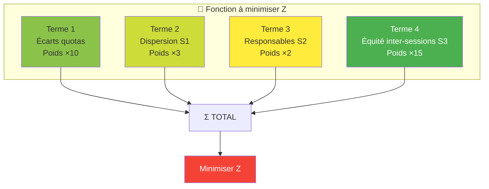

### Composition détaillée

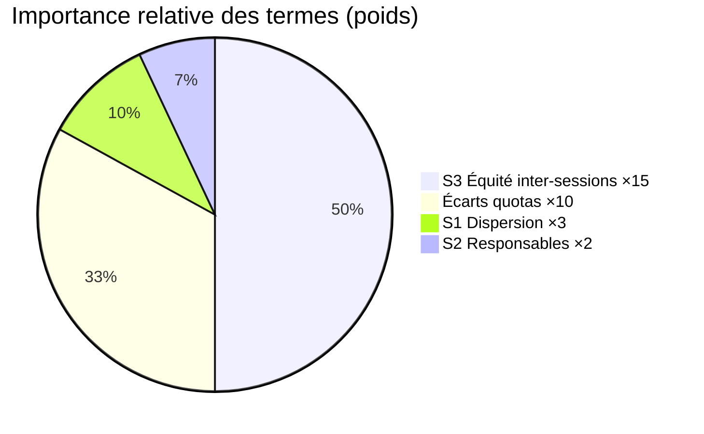

### Formulation complète

```
Minimiser : Z = Σ (|nb_aff[i] - quota[i]| × 10)          [Terme 1]
              i∈E
            
            + Σ (écart_séances × 10 × 3)                [Terme 2]
              
            + Σ (pénalité_absence_responsable × 2)       [Terme 3]
              
            + Σ (nb_aff[i] × coef_priorité[i] × 15)     [Terme 4]
              i avec quota_ajusté
```

### Décomposition

| Terme | Description | Poids | Priorité |
|-------|-------------|-------|----------|
| **Terme 1** | Écart par rapport aux quotas | ×10 | Haute |
| **Terme 2** | Dispersion journalière | ×3 | Moyenne |
| **Terme 3** | Présence responsables | ×2 | Basse |
| **Terme 4** | Équité inter-sessions | ×15 | **Très haute** |

### Hiérarchie des priorités

1. **Équité inter-sessions (S3)** : Poids **×15** → Compenser les sessions précédentes
2. **Équité intra-session (Terme 1)** : Poids **×10** → Distribuer équitablement
3. **Dispersion (S1)** : Poids **×3** → Éviter les séances consécutives
4. **Responsables (S2)** : Poids **×2** → Préférence légère

---

## 📊 Système de quotas ajustés

### Architecture du système

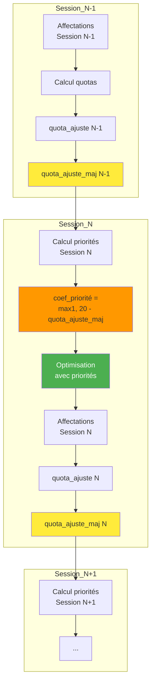

### Évolution des quotas sur 3 sessions

```mermaid
gantt
    title Évolution quotas - Enseignant A (quota théorique = 8)
    dateFormat X
    axisFormat %s
    
    section Session 1
    Surveillances (6) : 0, 6
    quota_ajuste_maj (6) : 0, 6
    
    section Session 2
    Surveillances (8) : 0, 8
    quota_ajuste_maj (14) : 0, 14
    
    section Session 3
    Surveillances (9) : 0, 9
    quota_ajuste_maj (23) : 0, 23
```

### Formules de priorité

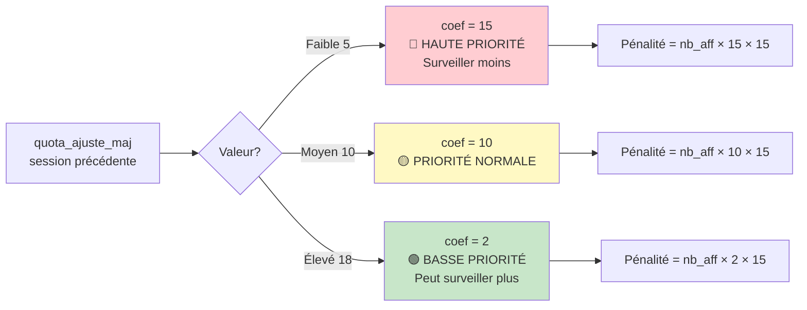

### Principe

Le système mémorise les quotas de surveillance de chaque enseignant à travers les sessions pour garantir l'équité globale.

### Table `quota_enseignant`

| Colonne | Description |
|---------|-------------|
| `code_smartex_ens` | Identifiant enseignant |
| `grade_code_ens` | Grade |
| `quota_grade` | Quota théorique du grade |
| `quota_ajuste` | Quota réel surveillé dans la session |
| `quota_ajuste_maj` | Quota cumulé après ajustement |
| `diff_quota_grade` | Écart par rapport au quota théorique |
| `diff_quota_majoritaire` | Écart par rapport à la moyenne du grade |

### Formules de calcul

```python
# Session N
quota_ajuste[N] = nb_surveillances_réelles[N]

# Session N+1
quota_ajuste_maj[N+1] = quota_ajuste_maj[N] + quota_ajuste[N]

# Coefficient de priorité pour session N+1
coef_priorité = max(1, 20 - quota_ajuste_maj[N])
```

### Exemple sur 3 sessions

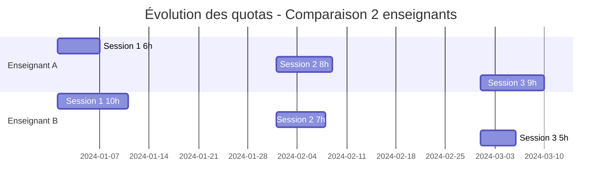

**Enseignant A (quota théorique = 8) :**

| Session | Surveillances | quota_ajuste_maj | Coefficient priorité | Impact |
|---------|---------------|------------------|---------------------|---------|
| S1 | 6 | 6 | 14 | Haute priorité (a peu surveillé) |
| S2 | 8 | 14 | 6 | Priorité normale |
| S3 | 9 | 23 | -3 → 1 | Basse priorité (a beaucoup surveillé) |

**Enseignant B (quota théorique = 8) :**

| Session | Surveillances | quota_ajuste_maj | Coefficient priorité | Impact |
|---------|---------------|------------------|---------------------|---------|
| S1 | 10 | 10 | 10 | Priorité moyenne |
| S2 | 7 | 17 | 3 | Basse priorité |
| S3 | 5 | 22 | -2 → 1 | Très basse priorité |

→ **Résultat** : L'algorithme favorisera l'enseignant A en S2 et B en S3 pour compenser les déséquilibres.

---

## 📝 Ordre d'application des contraintes

### Architecture du modèle

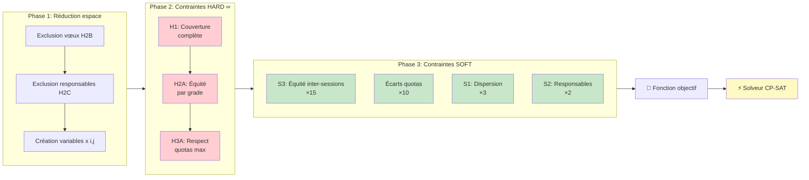

### Hiérarchie des priorités

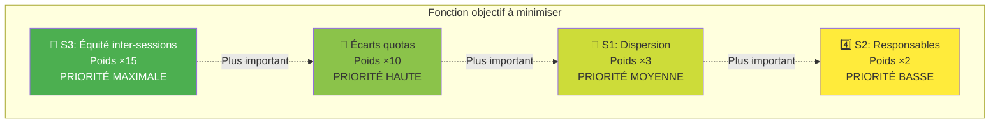

### Phase 1 : Réduction de l'espace

1. Exclusion par vœux (H2B)
2. Exclusion responsables (H2C)
3. Création des variables restantes

### Phase 2 : Contraintes dures

1. **H1** : Couverture complète (OBLIGATOIRE)
2. **H2A** : Équité stricte par grade (OBLIGATOIRE)
3. **H3A** : Respect quotas maximum (OBLIGATOIRE)

### Phase 3 : Contraintes souples (dans l'objectif)

1. **S3** : Équité inter-sessions (poids ×15)
2. **Terme 1** : Minimisation écarts quotas (poids ×10)
3. **S1** : Dispersion journalière (poids ×3)
4. **S2** : Présence responsables (poids ×2)

---

## 🔧 Paramètres du solveur

### Configuration OR-Tools CP-SAT

```python
solver = cp_model.CpSolver()
solver.parameters.max_time_in_seconds = 180  # Timeout : 3 minutes
solver.parameters.num_search_workers = 8      # Parallélisation : 8 threads
solver.parameters.log_search_progress = True  # Logs détaillés
```

### Paramètres clés

| Paramètre | Valeur | Description |
|-----------|--------|-------------|
| `max_time_in_seconds` | 180 | Temps maximum de recherche (3 min) |
| `num_search_workers` | 8 | Nombre de threads parallèles |
| `log_search_progress` | True | Affichage progression |

### Statuts possibles

| Statut | Signification |
|--------|---------------|
| `OPTIMAL` | Solution optimale trouvée |
| `FEASIBLE` | Solution valide trouvée (peut-être sous-optimale) |
| `INFEASIBLE` | Aucune solution respectant les contraintes dures |
| `MODEL_INVALID` | Erreur dans la formulation |
| `UNKNOWN` | Timeout sans solution |

---

## 🎓 Exemple complet

### Vue d'ensemble de l'exemple

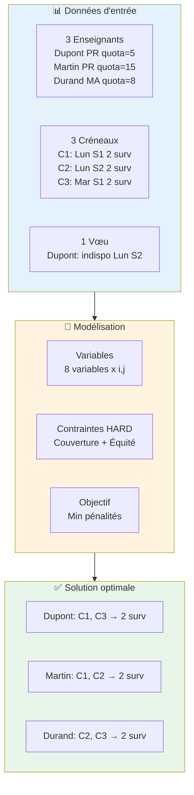

### Données d'entrée

**Enseignants :**
- Prof. Dupont (PR) : quota_ajusté_maj = 5 → priorité très haute
- Prof. Martin (PR) : quota_ajusté_maj = 15 → priorité basse
- Prof. Durand (MA) : quota_ajusté_maj = 8 → priorité moyenne

**Créneaux :**
- Créneau 1 (Lundi S1) : 2 surveillants requis
- Créneau 2 (Lundi S2) : 2 surveillants requis
- Créneau 3 (Mardi S1) : 2 surveillants requis

**Vœux :**
- Dupont : indisponible Lundi S2

### Modélisation

**Variables créées :**
```
x[Dupont, C1] ∈ {0,1}
x[Dupont, C3] ∈ {0,1}
x[Martin, C1] ∈ {0,1}
x[Martin, C2] ∈ {0,1}
x[Martin, C3] ∈ {0,1}
x[Durand, C1] ∈ {0,1}
x[Durand, C2] ∈ {0,1}
x[Durand, C3] ∈ {0,1}
```

Note : `x[Dupont, C2]` non créée (vœu H2B)

**Contraintes H1 (couverture) :**
```
x[Dupont,C1] + x[Martin,C1] + x[Durand,C1] = 2
x[Martin,C2] + x[Durand,C2] = 2
x[Dupont,C3] + x[Martin,C3] + x[Durand,C3] = 2
```

**Contraintes H2A (équité PR) :**
```
|nb[Dupont] - nb[Martin]| ≤ 1
```

**Objectif (simplifié) :**
```
Minimiser :
  + |nb[Dupont] - quota[Dupont]| × 10
  + |nb[Martin] - quota[Martin]| × 10
  + |nb[Durand] - quota[Durand]| × 10
  + nb[Dupont] × 15 × 15  (priorité très haute)
  + nb[Martin] × 2 × 15   (priorité basse)
  + nb[Durand] × 10 × 15  (priorité moyenne)
  + pénalités dispersion + pénalités responsables
```

### Solution optimale

```mermaid
gantt
    title Affectations optimales
    dateFormat HH:mm
    axisFormat %H:%M
    
    section Lundi
    Créneau 1 S1 : c1, 08:00, 2h
    Créneau 2 S2 : c2, 10:00, 2h
    
    section Mardi
    Créneau 3 S1 : c3, 08:00, 2h
```

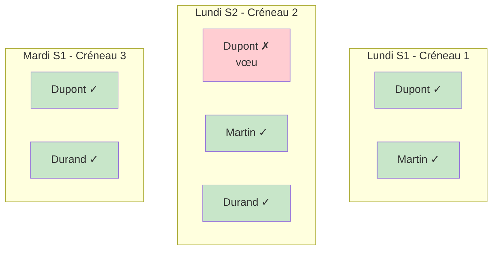

```
Dupont : C1, C3 → 2 surveillances (priorité très haute : minimisé)
Martin : C1, C2 → 2 surveillances
Durand : C2, C3 → 2 surveillances
```

**Vérification :**
- ✅ H1 : Tous les créneaux ont 2 surveillants
- ✅ H2A : Dupont et Martin (PR) ont le même nombre (écart = 0 ≤ 1)
- ✅ H2B : Dupont n'est pas affecté à C2
- ✅ H3A : Tous respectent leur quota
- ✅ S3 : Dupont (priorité très haute) a surveillé le minimum possible

---

## 📈 Avantages de l'approche

### Matrice des avantages

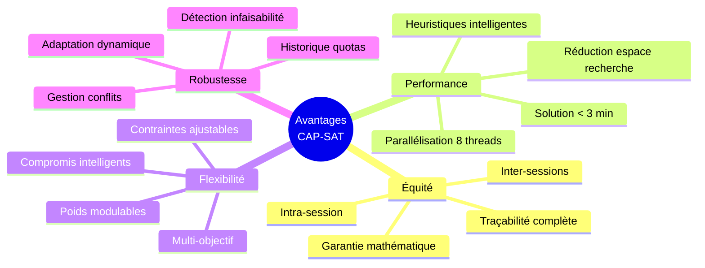

### Comparaison approches

```mermaid
graph LR
    subgraph Manuel[❌ Affectation manuelle]
        M1[Temps: jours]
        M2[Équité: non garantie]
        M3[Erreurs: fréquentes]
        M4[Traçabilité: faible]
    end
    
    subgraph Greedy[⚠️ Algorithme glouton]
        G1[Temps: secondes]
        G2[Équité: locale]
        G3[Optimal: non garanti]
        G4[Contraintes: limitées]
    end
    
    subgraph CAPSAT[✅ CAP-SAT]
        C1[Temps: < 3 min]
        C2[Équité: garantie]
        C3[Optimal: global]
        C4[Contraintes: complexes]
    end
    
    style Manuel fill:#ffcdd2
    style Greedy fill:#fff9c4
    style CAPSAT fill:#c8e6c9
```

### 1. Équité garantie
- Contraintes dures assurent l'équité stricte intra-session
- Contrainte S3 assure l'équité inter-sessions

### 2. Flexibilité
- Contraintes souples permettent des compromis intelligents
- Pondération ajustable selon les priorités

### 3. Performance
- Réduction efficace de l'espace de recherche
- Parallélisation sur 8 threads
- Solutions en < 3 minutes pour problèmes réels

### 4. Traçabilité
- Quotas ajustés stockés en base
- Historique complet des sessions
- Justification des décisions d'affectation

---

## 🔄 Workflow complet

```mermaid
graph TD
    A[📥 Chargement données Session N] --> B[🔍 Récupération quotas ajustés Session N-1]
    B --> C[📊 Calcul priorités<br/>quota_ajusté_maj]
    C --> D[🧮 Création modèle CP-SAT]
    D --> E[🔒 Ajout contraintes HARD<br/>H1, H2A, H2B, H2C, H3A]
    E --> F[🎨 Ajout contraintes SOFT<br/>S1, S2, S3 dans objectif]
    F --> G[⚡ Résolution OR-Tools<br/>max 3 minutes]
    G --> H{Solution trouvée?}
    H -->|Oui| I[📋 Extraction solution]
    H -->|Non| J[❌ Erreur: infaisable]
    I --> K[🏫 Affectation équitable salles]
    K --> L[💾 Sauvegarde en base]
    L --> M[📈 Calcul quotas ajustés Session N]
    M --> N[🔄 Mise à jour pour Session N+1]
    N --> O[✅ Terminé]
    
    style A fill:#e1f5ff
    style G fill:#fff3cd
    style H fill:#f8d7da
    style O fill:#d4edda
```

---

## 📚 Références

- **OR-Tools CP-SAT Solver** : https://developers.google.com/optimization/cp/cp_solver
- **Constraint Programming** : https://en.wikipedia.org/wiki/Constraint_programming
- **SAT Solving** : https://en.wikipedia.org/wiki/Boolean_satisfiability_problem

---

## ✍️ Auteur

Système développé pour la gestion automatisée des surveillances d'examens universitaires.

**Date de dernière mise à jour** : Octobre 2025

---

## 📞 Support

Pour toute question sur l'algorithme ou son implémentation, veuillez consulter le code source dans :
- `scripts/optimize_example.py` : Implémentation complète
- `routes/optimize_routes.py` : API d'optimisation
- `scripts/quota_enseignant_module.py` : Gestion des quotas ajustés
